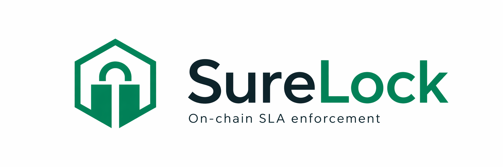
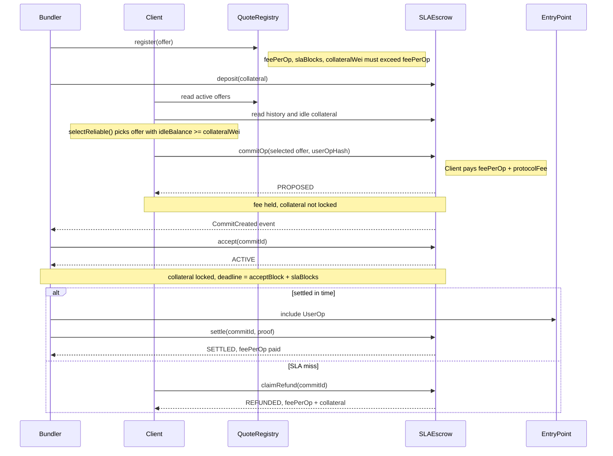

<p align="center">
  
</p>

[](https://www.npmjs.com/package/@surelock-labs/protocol)
[](https://www.npmjs.com/package/@surelock-labs/router)
[](https://www.npmjs.com/package/@surelock-labs/bundler)

On-chain SLA enforcement for ERC-4337 bundlers.

A bundler posts collateral and commits to including your UserOp within N blocks. If they miss the deadline, collateral is slashed. No arbitration, no trusted oracle, no off-chain attestation.

> **Status:** Base Sepolia testnet. Mainnet deploy pending external audit.

---

## The problem

ERC-4337 bundlers are unaccountable. If your bundler drops a UserOp or goes offline, your users can't transact -- with no SLA, no on-chain recourse, no refund.

Existing routers work around failures after the fact. None enforce delivery commitments with on-chain collateral.

## How it works



### Settlement proof

`settle()` requires a Merkle Patricia Trie receipt proof showing the committed `userOpHash` was emitted by the EntryPoint at or before the deadline block. Verified on-chain against `blockhash()` -- no trusted party can forge it.

**EVM constraint:** the EVM only retains the 256 most recent block hashes. So `settle()` must be submitted within 256 blocks of inclusion. A bundler who includes early in a long SLA window must settle promptly; late inclusion followed by immediate settlement is always safe.

### Two-phase design

`accept()` is explicit bundler consent. Before acceptance, the client can cancel (via `cancel()` + `claimPayout()`) and recover `feePerOp`. `protocolFee` (if non-zero) is retained by the protocol on all cancel paths; gas is not recovered. No collateral is at risk until acceptance.

This prevents fake-hash griefing: a bundler who accepts is on the hook.

### quoteId vs bundler address

`quoteId` is an offer-instance ID -- it changes each time a bundler re-registers. The stable identity key is the bundler's address.

Clients route to a bundler's RPC endpoint by address, not by quoteId. The address -> RPC mapping is intentionally off-chain (operator-curated list); there is no on-chain directory at launch.

---

## Scope and limitations

### What SureLock is

A bounded, collateral-backed SLA enforcement layer. When a bundler accepts a commitment, slashing is enforced by the contract: no party can alter the committed terms after `commit()`, grant exceptions, or block `settle()` / `claimRefund()`.

### What SureLock is not

- **Not an absolute inclusion guarantee.** A bundler who does not call `accept()` within the grace window creates a liveness delay, not fund theft. The client can call `cancel()` -- once the commitment reaches `CANCELLED`, `feePerOp` is returned and the hash slot clears. The slot does not clear automatically on window expiry; an authorized actor must call `cancel()` for the state transition to complete. There is no on-chain mechanism to force acceptance or reroute a PROPOSED commitment to a different bundler during the accept window.
- **Not an insurer or discretionary backstop.** On SLA miss the client recovers `feePerOp` plus the full slashed collateral -- a bounded contractual remedy. There is no reserve fund, no make-whole, and no recovery path outside the three terminal states (SETTLED, REFUNDED, CANCELLED).
- **No guaranteed acceptance ordering.** Bundlers may selectively ignore commitments. `selectReliable()` filters by historic accept and settle rates, but cannot force acceptance of any individual commitment.

### Commit-time vs. settlement-time

`commitOp()` binds a specific `userOpHash` at a specific block. Settlement later proves on-chain that the exact same hash was emitted by the EntryPoint within the SLA window. The proof is a `blockhash`-anchored MPT receipt proof -- no trusted party, but bounded by the EVM's 256-block window. Bundlers must call `settle()` within 256 blocks of inclusion; late inclusion followed by immediate settlement is always safe.

The same `userOpHash` cannot be committed more than once (T23: hashes are permanently retired after any terminal state). Parallel routing requires a fresh UserOp with a fresh hash for each attempt.

### Known limitations

| Limitation | Detail |
|---|---|
| Accept-window reroute delay | A PROPOSED commitment cannot be rerouted until the accept window expires and `cancel()` is called. Max delay: `ACCEPT_GRACE_BLOCKS` (~24 s on Base). |
| Bundler acceptance selectivity | Bundlers choose which commitments to accept; no on-chain FIFO enforcement. Use `selectReliable()` to filter by historic rates. |
| Settlement blockhash window | `settle()` must be submitted within 256 blocks of inclusion. Early inclusion with a long SLA window requires the bundler to settle promptly. |
| No deep-reorg protection | Proof is anchored to `blockhash()`. A reorg deeper than the inclusion block voids the proof; `claimRefund()` becomes available after the refund window opens. |

---

## Packages

| Package | Description | Install |
|---|---|---|
| [`@surelock-labs/protocol`](packages/protocol/) | Contracts, ABIs, TypeChain types, deployment addresses | `npm install @surelock-labs/protocol` |
| [`@surelock-labs/router`](packages/router/) | Fetch quotes, score bundlers, commit UserOps (client-side) | `npm install @surelock-labs/router` |
| [`@surelock-labs/bundler`](packages/bundler/) | Register offers, watch commits, build MPT proofs, settle (bundler-side) | `npm install @surelock-labs/bundler` |

### Client quick start

```typescript
import { createRouter, DEPLOYMENTS } from "@surelock-labs/router";
import { ethers } from "ethers";

const provider = new ethers.JsonRpcProvider("https://sepolia.base.org");
const signer   = new ethers.Wallet(PRIVATE_KEY, provider);
const { registry, escrow } = DEPLOYMENTS[84532]; // Base Sepolia

const router = createRouter({
  rpcUrl:           "https://sepolia.base.org",
  registryAddress:  registry,
  escrowAddress:    escrow,
});

// selectReliable() scores bundlers by acceptRate, settleRate, idleRatio,
// and median time-to-accept -- then picks the highest-scoring offer with
// enough idle collateral to actually accept right now.
const best = await router.selectReliable();
if (!best) throw new Error("no reliable offers");

const { commitId } = await router.commitOp(signer, best, userOpHash);
// bundler must accept within ACCEPT_GRACE_BLOCKS or client can cancel and recover feePerOp (protocolFee is non-refundable)
```

### Bundler quick start

```typescript
import { createBundlerClient, DEPLOYMENTS } from "@surelock-labs/bundler";
import { ethers } from "ethers";

const dep = DEPLOYMENTS[84532]; // Base Sepolia
const client = createBundlerClient({
  rpcUrl:          "https://sepolia.base.org",
  registryAddress: dep.registry,
  escrowAddress:   dep.escrow,
});

await client.deposit(signer, ethers.parseEther("0.1"));

const offer = await client.register(signer, {
  feePerOp:      ethers.parseUnits("100", "gwei"),
  slaBlocks:     10,                                // ~20s on Base
  collateralWei: ethers.parseUnits("200", "gwei"), // must be strictly > feePerOp
});
// offer.quoteId, offer.bundler, etc. are all populated

client.watchCommits(signer.address, async (commit) => {
  await client.accept(signer, commit.commitId);
  // ...include commit.userOpHash via EntryPoint, then after it mines:
  const { blockHeaderRlp, receiptProof, txIndex } =
    await client.buildSettleProof(inclusionBlock, inclusionTxHash);
  await client.settle(signer, commit.commitId, BigInt(inclusionBlock), blockHeaderRlp, receiptProof, txIndex);
});
```

---

## Deployments

### Base Sepolia (chainId 84532)

| Contract | Address |
|---|---|
| QuoteRegistry | [`0x8D15232a45903602411EF1494a10201Ad3d4EA47`](https://sepolia.basescan.org/address/0x8D15232a45903602411EF1494a10201Ad3d4EA47#code) |
| SLAEscrow (proxy) | [`0x508eB40826ce7042dB14242f278Bb4a9AbB0D82A`](https://sepolia.basescan.org/address/0x508eB40826ce7042dB14242f278Bb4a9AbB0D82A#code) |
| SLAEscrow (impl) | [`0xe3a465972E8ab8f258d1718F48e2933d0B2117A5`](https://sepolia.basescan.org/address/0xe3a465972E8ab8f258d1718F48e2933d0B2117A5#code) |
| TimelockController (1h testnet) | [`0xd9Fa5FeA0B26ecA0e3B19a0A5FDaec8BaB76A4Ba`](https://sepolia.basescan.org/address/0xd9Fa5FeA0B26ecA0e3B19a0A5FDaec8BaB76A4Ba#code) |

Both contracts verified on Sourcify. SLAEscrow is a UUPS proxy behind a TimelockController (1h on testnet, 48h on mainnet).

Upgrading requires the full sequence: call `freezeCommits()` -> wait ~34 min for in-flight commits to resolve -> schedule upgrade through timelock -> wait the timelock delay -> execute. No upgrade can bypass this window.

### Base Mainnet

Not yet deployed.

---

## Gas (Base Sepolia, measured 2026-04-23)

| Operation | Gas units | Notes |
|---|---|---|
| `commit()` | 202,383 | Hot path -- client commits UserOp |
| `accept()` | 85,676 | Bundler accepts, locks collateral |
| `settle()` | 265,986 | Real EntryPoint + MPT proof (`demo-settle.ts`) |
| `claimRefund()` | 76,186 | SLA miss -- client recovers fee + collateral |
| `cancel()` | 84,905 | Unaccepted commit after accept window |
| `claimPayout()` | 41,427 | Withdraw pending balance |
| `deposit()` | 72,836 | Bundler deposits collateral |
| `withdraw()` | 38,384 | Bundler withdraws idle collateral |
| `register()` | 120,770 | Register bundler offer |
| `renew()` | 31,028 | Renew offer before expiry |
| `deregister()` | 55,223 | Deactivate offer, move bond to pending |
| `claimBond()` | 36,442 | Pull pending registry bond |

---

## Protocol constants (v0.8)

| Constant | Value | Meaning |
|---|---|---|
| `ACCEPT_GRACE_BLOCKS` | 12 | ~24s on Base -- bundler must accept within this window |
| `SETTLEMENT_GRACE_BLOCKS` | 10 | ~20s after SLA deadline -- bundler can still settle |
| `REFUND_GRACE_BLOCKS` | 5 | ~10s dead zone prevents settle/refund race |
| `MAX_SLA_BLOCKS` | 1,000 | ~33 min -- max SLA window an offer may specify |
| `MAX_PROTOCOL_FEE_WEI` | 0.001 ETH | Fee ceiling; starts at 0 (inactive at launch) |
| `MIN_BOND` | 0.0001 ETH | Lower bound for the configurable registration bond |

---

## Verification

### Formal verification -- Certora Prover

**27/27 specs PASS** (full run 2026-04-19). See [`certora/STATUS.md`](certora/STATUS.md) for all job URLs, scope notes, and NONDET summaries.

| Spec | Covers | Result |
|---|---|---|
| `A4_eth_conservation` | ETH conservation invariant | [PASS](https://prover.certora.com/output/5373370/f48c3a762ac947df8be8836094a19a7e) |
| `A4_commit_accounting` | commit() field snapshot completeness | [PASS](https://prover.certora.com/output/5373370/41a634d461774592a16859cfb6285024) |
| `T2_idle_withdrawable` | Idle balance always withdrawable | [PASS](https://prover.certora.com/output/5373370/32dc6db9ad78445ead5761d4c9effa10) |
| `T8_cheating_net_negative` | Cheating is net-negative EV | [PASS](https://prover.certora.com/output/5373370/d72b4f3a89c64016821582a82ff19147) |
| `T8_collateral_strict` | Collateral strictly > fee | [PASS](https://prover.certora.com/output/5373370/ec66c93838b141e299ff56cb6f24063e) |
| `T9_offer_identity` | Offer terms immutable after commit | [PASS](https://prover.certora.com/output/5373370/2d1d5174a4554e5ca677c838e67ab478) |
| `T12_no_capital_lock` | No capital permanently locked | [PASS](https://prover.certora.com/output/5373370/1287c0620e8c490cb9003c204bf917a6) |
| `T19_liveness` | All commitments resolve in finite time | [PASS](https://prover.certora.com/output/5373370/601a162b1f42492e8bf378c998608241) |
| `T23_hash_uniqueness` | Each userOpHash committed at most once | [PASS](https://prover.certora.com/output/5373370/7293766d78ba4fe4a5327c2122c05d47) |
| `T25_bundler_consent` | No collateral locked before accept() | [PASS](https://prover.certora.com/output/5373370/435de8bc5ee848b580cbcfe328e4a44b) |

### Symbolic execution -- Kontrol

18 `testProp_*` properties proved (2026-04-14). Additional `testProp_*` tests have been added since and run as concrete Foundry tests; a full Kontrol re-run is pending.

### Static analysis

- **Slither** -- 0 high/medium findings in the current baseline.
- **Aderyn** -- 0 high findings in the current baseline.

### Test suite

Current source includes 1,900 Hardhat test cases, including 1,441 adversarial cases across 19 category files:

fund theft . collateral manipulation . fee bypass . state machine attacks . timing attacks . registry attacks . reentrancy . ETH accounting . integer arithmetic . multi-party attacks . proxy attacks . timelock attacks . access control . commit lifecycle . economic griefing . proxy integrity . audit fixes . two-phase attacks . exact invariants

Plus 41 Foundry tests (31 `testProp_*` + 10 `invariant_*`).

---

## Running locally

```bash
npm install
npx hardhat compile
npm test
```

### Examples

Each script deploys fresh contracts and runs one scenario end-to-end.

```bash
npx hardhat run examples/happy.ts        # register -> commit -> settle
npx hardhat run examples/sla-miss.ts     # bundler misses -> client refunded
npx hardhat run examples/cancelled.ts    # unaccepted commit -> cancel
npx hardhat run examples/adversarial/double-commit.ts
npx hardhat run examples/adversarial/underfunded.ts
```

Output from the happy path:

```
-- deploy -----------------------------------------------
  registry : 0x59b670...
  escrow   : 0x322813...

-- committed 0  userOpHash: 0xe34b81f9... --
-- settled -- bundler earned 5000.0 gwei --
  Commit #0  [SETTLED]
    feePaid:   5000.0 gwei   collateralLocked: 10000.0 gwei
    deadline:  block 73      inclusionBlock:   69
```

### Playground REPL

```bash
npx hardhat play
```

```typescript
const bx = w.bundler(w.a)
const quoteId = await bx.register({ slaBlocks: 10 })
await bx.deposit(w.eth(0.01))
const cx = w.client(w.b)
const { commitId } = await cx.commit(quoteId)
await bx.include(commitId)   // accept + settle (playground shorthand)
await w.print.state()
```

---

## Repository structure

```
contracts/          Solidity source (SLAEscrow, QuoteRegistry, Timelock, MerkleTrie)
test/               Hardhat tests + Foundry invariants
certora/            Certora Prover specs and configuration
audit/              Slither, Aderyn, Kontrol tooling (Dockerfile + scripts)
docs/
  DESIGN.md         Protocol axioms and theorems (behavioral reference)
packages/
  protocol/         @surelock-labs/protocol  -- ABIs, types, deployment addresses (MIT)
  router/           @surelock-labs/router    -- client-side SDK (MIT)
  bundler/          @surelock-labs/bundler   -- bundler-side SDK (MIT)
playground/         Interactive REPL with pre-deployed contracts
examples/           Lifecycle scenarios (happy path, SLA miss, adversarial)
```

---

## Trust model

SureLock is minimized-trust infrastructure, not zero-trust.

**Bundler-client guarantees** are mathematical. Collateral, deadlines, and slashing are enforced by the contract and cannot be altered by any party after `commit()`.

**Protocol (the deployer)** controls the admin key, fee recipient, and upgrade path. SLAEscrow is a UUPS proxy behind a 48h TimelockController -- any upgrade requires 48h public on-chain notice. Before mainnet the timelock proposer will be replaced by a Safe multisig (safe.global).

**Protocol fee** is 0 at launch. It can only be raised to `MAX_PROTOCOL_FEE_WEI` (0.001 ETH) through the timelock.

**feeRecipient rotation:** fees already credited to the old recipient remain withdrawable only by that address after rotation. Only newly accumulated fees flow to the new recipient.

---

## License

Repository: [Business Source License 1.1](LICENSE) (converts to GPLv2+ on 2028-04-15).

SDK packages (`packages/*`): [MIT](packages/protocol/LICENSE).
