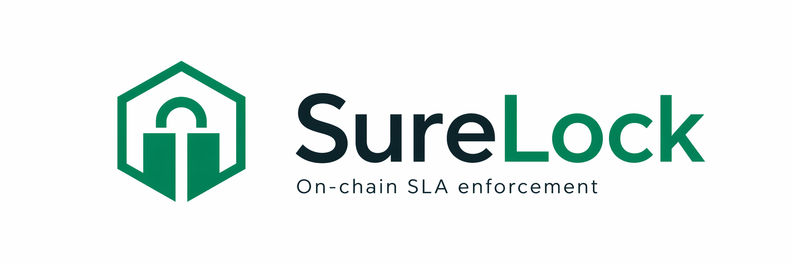

<p align="center">
  
</p>

# SureLock

SureLock is a collateral-backed inclusion SLA for ERC-4337 UserOperations.

Providers publish offers, clients commit a `userOpHash`, and authorized watchers resolve the outcome from EntryPoint activity. If the operation is included in time, the provider earns the fee; if the SLA is missed, the client receives the fee plus the provider's locked collateral.

See [Protocol overview](docs/PROTOCOL.md) for the lifecycle and resolution paths.

## Development

```bash
forge build
forge test
forge coverage
```

## License

SureLock Protocol Core is licensed under the Business Source License 1.1 (`BUSL-1.1`), see [LICENSE](LICENSE). Each file states the applicable license type in its SPDX header.
