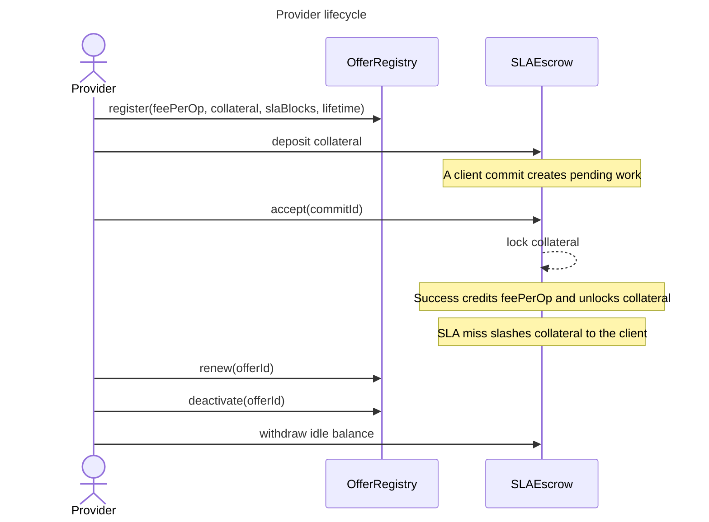
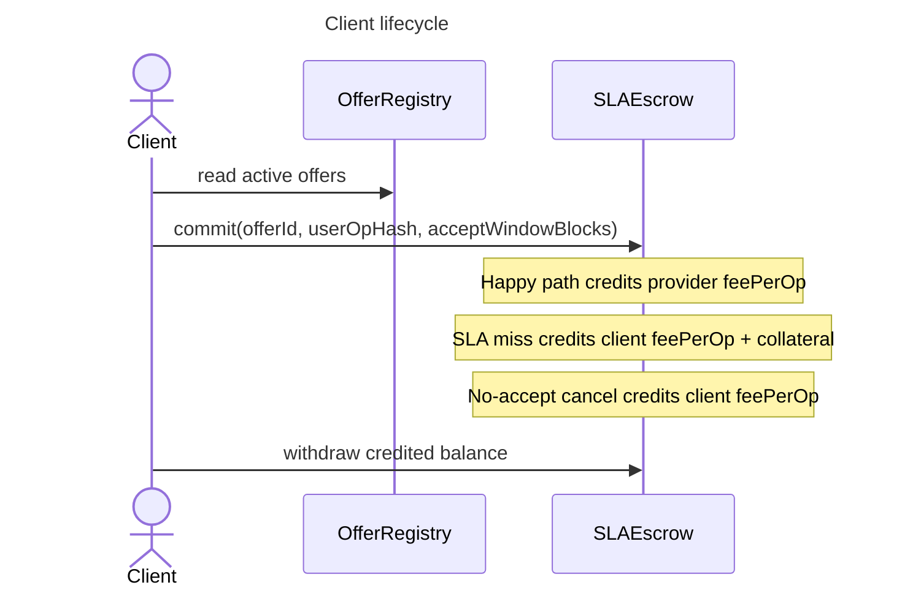
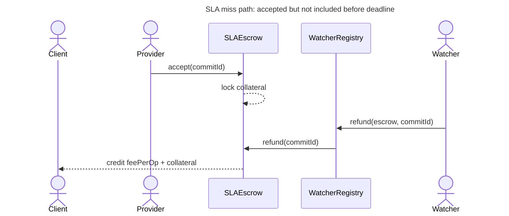
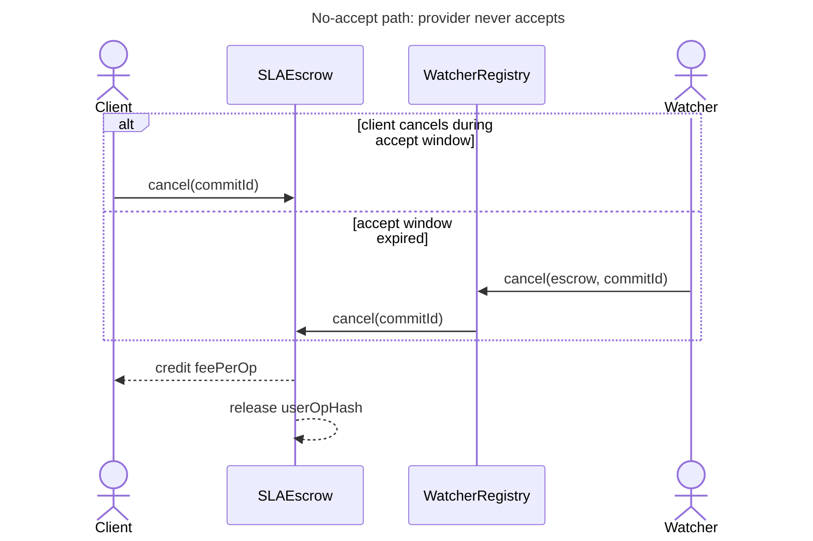

# Protocol Overview

SureLock separates three things that are easy to confuse:

- `commit()` reserves a specific `userOpHash`; provider collateral is not locked yet.
- `accept()` is the provider's explicit consent; collateral locks and the SLA deadline starts.
- Watchers resolve outcomes. They observe EntryPoint activity off-chain and call `settle`, `refund`, or `cancel`; the contracts enforce timing, authorization, and payout accounting.

Balances are internal credits. Providers, clients, and the fee recipient withdraw credited funds explicitly.

