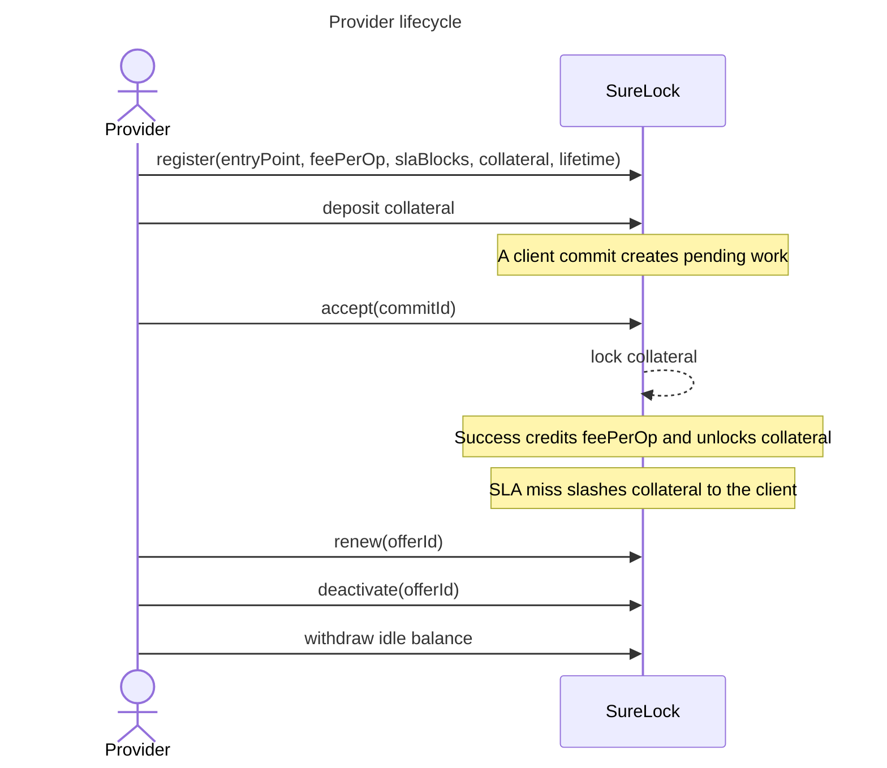
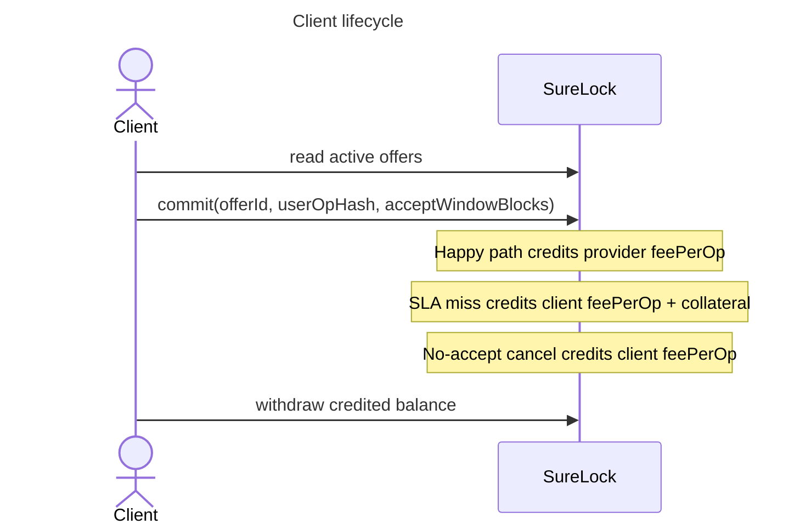
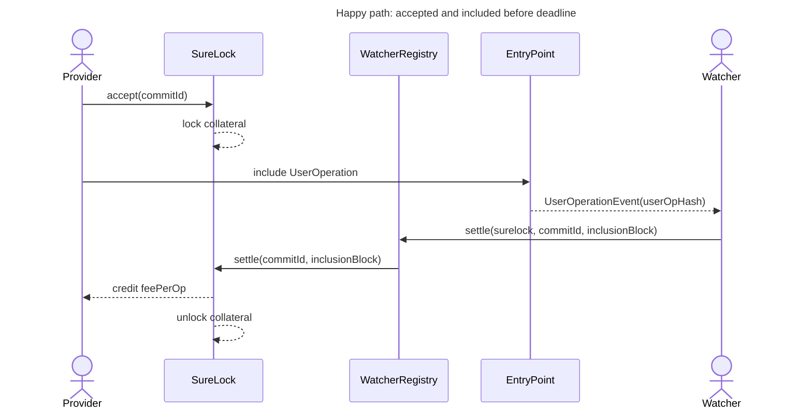
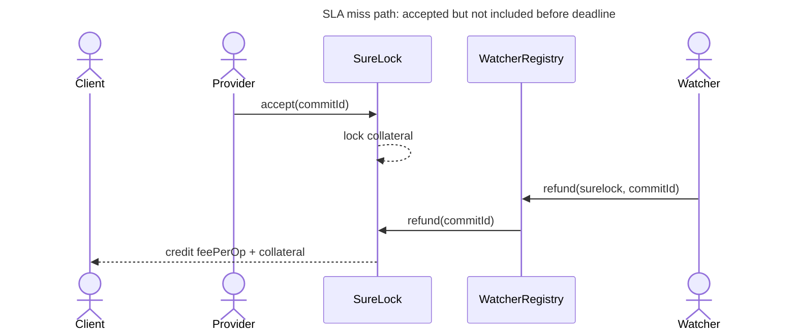
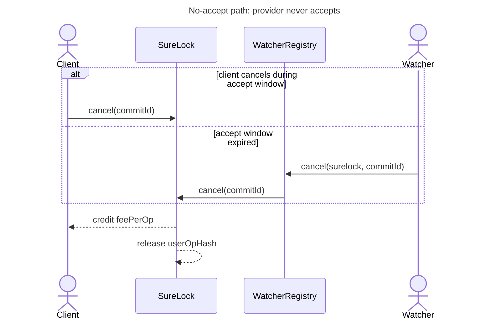

# Protocol Overview

SureLock separates three things that are easy to confuse:

- `commit()` reserves a specific `userOpHash`; provider collateral is not locked yet.
- `accept()` is the provider's explicit consent; collateral locks and the SLA deadline starts.
- Each offer declares one compatible EntryPoint. This is a provider capability claim used by routers and watchers, not a cryptographic proof.
- Watchers resolve outcomes. They observe EntryPoint activity off-chain and call `settle`, `refund`, or `cancel`; the contracts enforce timing, authorization, and payout accounting.

Balances are internal credits. Providers, clients, and the fee recipient withdraw credited funds explicitly.

Offers and commitments live in the same `SureLock` contract. `WatcherRegistry` only authorizes watcher accounts and forwards resolution calls.

## Reference

| From | Action | To |
|---|---|---|
| none | `commit` | `Proposed` |
| `Proposed` | `accept` | `Active` |
| `Proposed` | `cancel` | `Cancelled` |
| `Active` | `settle` | `Settled` |
| `Active` | `refund` | `Refunded` |

